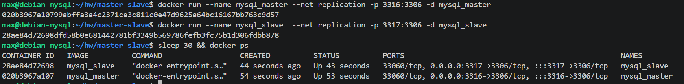
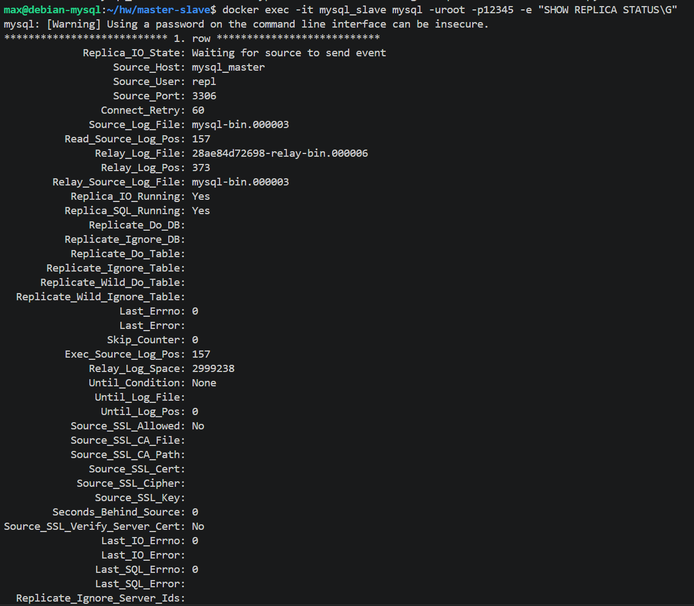
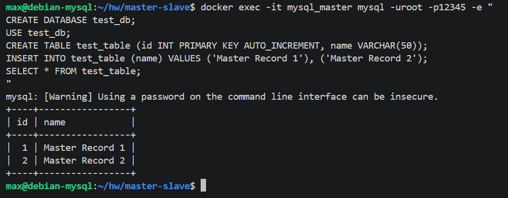
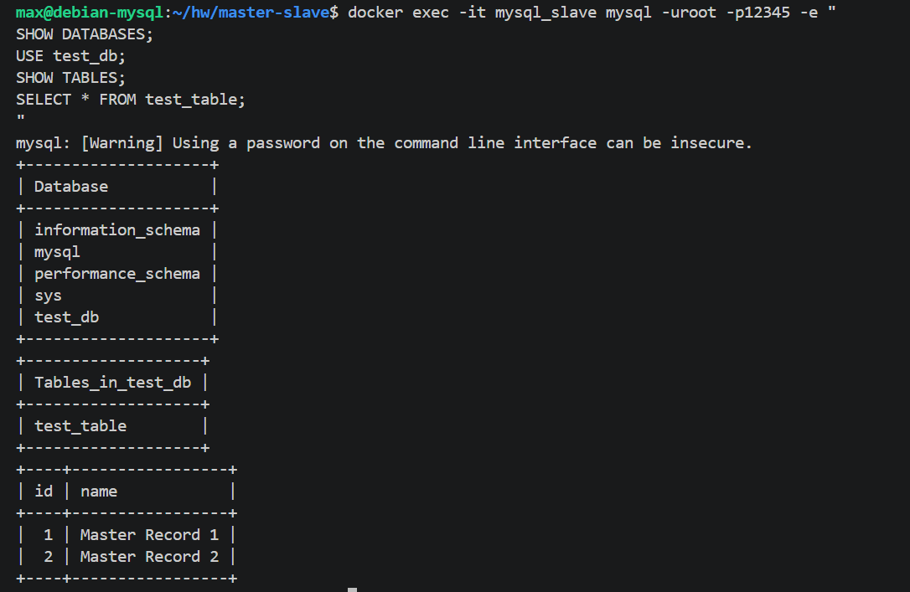
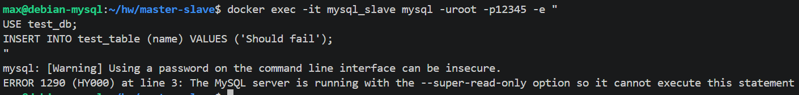
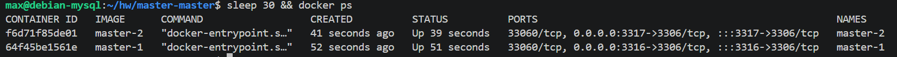
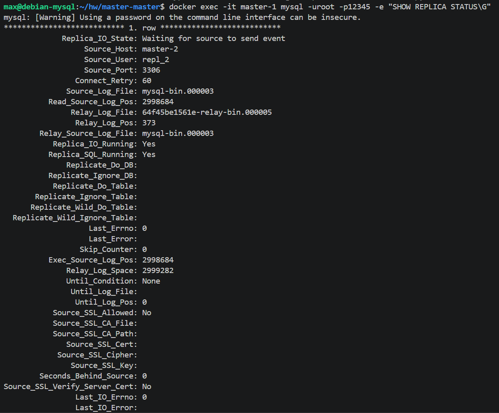
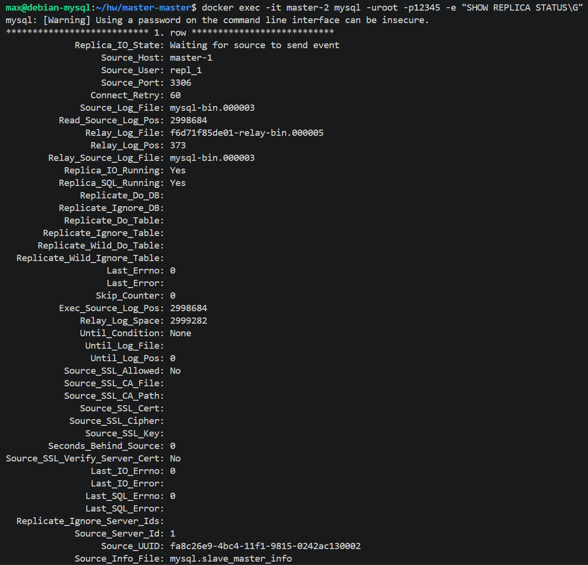
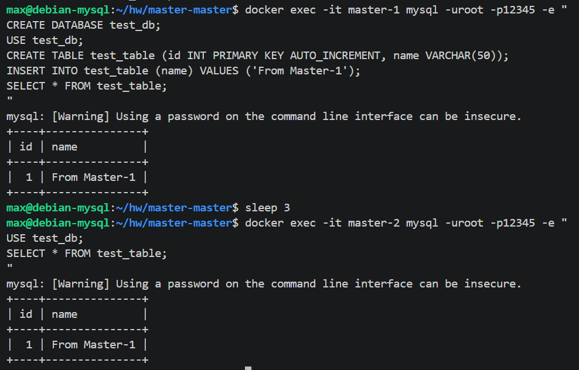
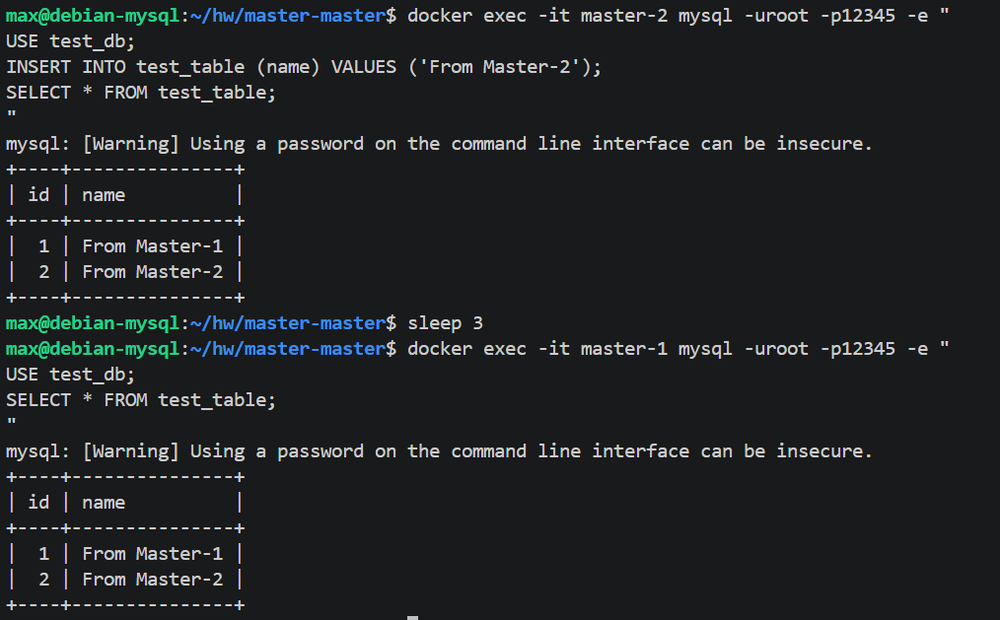

# Домашнее задание к занятию «Репликация и масштабирование. Часть 1» - Моськов Максим

---

## Задание 1
 
**Master-slave** — это асимметричная схема репликации. В ней есть один ведущий сервер (master) и один или несколько подчинённых (slave). Все операции записи (INSERT, UPDATE, DELETE) выполняются исключительно на мастере, а слейвы получают изменения через бинарный лог и обслуживают только запросы на чтение (SELECT). На слейве, как правило, включают режим `read_only` (а ещё лучше — `super_read_only`, иначе пользователи с правами SUPER, в том числе root, смогут писать в обход), чтобы случайно не записать туда данные напрямую и не сломать репликацию рассинхроном. Эта схема хорошо подходит для систем, в которых чтения значительно превышают записи: нагрузку чтения можно горизонтально масштабировать, добавляя новые слейвы.
 
**Master-master** — это симметричная схема, в которой каждый из серверов одновременно является и мастером, и слейвом по отношению к другому. Запись можно выполнять на любом из узлов, и изменения будут реплицированы на остальные. Такая конфигурация повышает отказоустойчивость: при выходе одного сервера из строя приложение может продолжать работу через второй без переключения роли вручную. При этом нужно следить за конфликтами — в первую очередь по автоинкрементным первичным ключам (для этого на серверах настраивают `auto_increment_increment` и разные `auto_increment_offset`).
 
**Ключевые различия:**
 
| Критерий | master-slave | master-master |
|---|---|---|
| Куда можно писать | Только на master | На любой из master-серверов |
| Откуда читать | С slave (и при необходимости с master) | С любого из узлов |
| Направление репликации | Одностороннее (master → slave) | Двустороннее |
| Роль `read_only` на одном из узлов | Да, на slave | Нет, оба пишут |
| Риск конфликтов записи | Отсутствует (пишет только один) | Есть (одновременная запись с одинаковым PK на разных узлах) |
| Необходимость `auto_increment_offset` | Нет | Да, чтобы не было конфликтов автоинкремента |
| Основной сценарий применения | Масштабирование чтения, бэкап-реплика | Высокая доступность записи, гео-распределение |
| Сложность настройки и сопровождения | Ниже | Выше |
 
**Что общего:** обе схемы используют бинарный лог (`binary log`) на источнике и журнал ретрансляции (`relay log`) на приёмнике; обе **не являются заменой резервного копирования** — случайно удалённые на одном узле данные будут удалены и на остальных репликах.
 
---
 
## Задание 2
  
Развёртывание выполнено в Docker внутри ВМ Debian 12. Поскольку на хосте уже занят порт 3306 системным MySQL, для контейнеров используются хост-порты `3316` (мастер) и `3317` (слейв). Внутри Docker-сети контейнеры обращаются друг к другу по именам.
 
### Конфигурационные файлы
 
`master-slave/master.cnf`:
```ini
[mysqld]
server-id=1
log-bin=mysql-bin
binlog_format=ROW
```
 
`master-slave/slave.cnf`:
```ini
[mysqld]
server-id=2
read_only=1
super_read_only=1
```
 
### Файлы инициализации
 
`master-slave/master.sql` — создание пользователя для репликации:
```sql
CREATE USER 'repl'@'%' IDENTIFIED WITH mysql_native_password BY 'slavepass';
GRANT REPLICATION SLAVE ON *.* TO 'repl'@'%';
FLUSH PRIVILEGES;
```
 
`master-slave/slave.sql` — указание источника репликации:
```sql
CHANGE REPLICATION SOURCE TO
  SOURCE_HOST='mysql_master',
  SOURCE_USER='repl',
  SOURCE_PASSWORD='slavepass',
  GET_SOURCE_PUBLIC_KEY=1;
START REPLICA;
```
 
### Dockerfile'ы
 
`master-slave/Dockerfile_master`:
```Dockerfile
FROM mysql:8.0
COPY ./master.cnf /etc/mysql/conf.d/my.cnf
COPY ./master.sql /docker-entrypoint-initdb.d/start.sql
ENV MYSQL_ROOT_PASSWORD=12345
CMD ["mysqld"]
```
 
`master-slave/Dockerfile_slave`:
```Dockerfile
FROM mysql:8.0
COPY ./slave.cnf /etc/mysql/conf.d/my.cnf
COPY ./slave.sql /docker-entrypoint-initdb.d/start.sql
ENV MYSQL_ROOT_PASSWORD=12345
CMD ["mysqld"]
```
 
### Команды запуска
 
```bash
cd master-slave
 
# Сборка образов
docker build -t mysql_master -f ./Dockerfile_master .
docker build -t mysql_slave  -f ./Dockerfile_slave  .
 
# Создание общей сети
docker network create replication
 
# Запуск контейнеров
docker run --name mysql_master --net replication -p 3316:3306 -d mysql_master
docker run --name mysql_slave  --net replication -p 3317:3306 -d mysql_slave
```
 
### Состояние и режимы работы серверов
 
Оба контейнера запущены, мастер слушает 3316, слейв — 3317:
 

 
Статус репликации на слейве — `Replica_IO_Running: Yes`, `Replica_SQL_Running: Yes`, `Seconds_Behind_Source: 0`, ошибок нет:
 

 
### Проверка работы репликации
 
На мастере создаётся база `test_db`, таблица `test_table` и две записи:
 

 
На слейве, без какого-либо вмешательства, та же база, та же таблица и те же записи — данные приехали с мастера через бинарный лог:
 

 
Проверка режима `read_only`/`super_read_only` на слейве: попытка прямой записи отклоняется ошибкой `ERROR 1290 ... --super-read-only option`:
 

 
Master-slave репликация работает корректно.
 
---
 
## Задание 3* (со звёздочкой)

Развёртывание тоже выполнено в Docker. Хост-порты — `3316` (master-1) и `3317` (master-2). На обоих серверах включён бинарный лог, а для предотвращения конфликтов автоинкрементных PRIMARY KEY использованы параметры `auto_increment_increment=2` и разные `auto_increment_offset` (1 и 2 соответственно).
 
### Конфигурационные файлы
 
`master-master/master-1.cnf`:
```ini
[mysqld]
server-id=1
log-bin=mysql-bin
binlog_format=ROW
auto_increment_increment=2
auto_increment_offset=1
```
 
`master-master/master-2.cnf`:
```ini
[mysqld]
server-id=2
log-bin=mysql-bin
binlog_format=ROW
auto_increment_increment=2
auto_increment_offset=2
```
 
> Параметры `auto_increment_increment` и `auto_increment_offset` нужны, чтобы при одновременной записи на оба сервера не возникало коллизий автоинкрементных PRIMARY KEY: master-1 генерирует нечётные ID (1, 3, 5, ...), master-2 — чётные (2, 4, 6, ...).
 
### Файлы инициализации
 
`master-master/master-1.sql`:
```sql
CREATE USER 'repl_1'@'%' IDENTIFIED WITH mysql_native_password BY 'pass';
GRANT REPLICATION SLAVE ON *.* TO 'repl_1'@'%';
FLUSH PRIVILEGES;
 
CHANGE REPLICATION SOURCE TO
  SOURCE_HOST='master-2',
  SOURCE_USER='repl_2',
  SOURCE_PASSWORD='pass',
  GET_SOURCE_PUBLIC_KEY=1;
 
START REPLICA;
```
 
`master-master/master-2.sql`:
```sql
CREATE USER 'repl_2'@'%' IDENTIFIED WITH mysql_native_password BY 'pass';
GRANT REPLICATION SLAVE ON *.* TO 'repl_2'@'%';
FLUSH PRIVILEGES;
 
CHANGE REPLICATION SOURCE TO
  SOURCE_HOST='master-1',
  SOURCE_USER='repl_1',
  SOURCE_PASSWORD='pass',
  GET_SOURCE_PUBLIC_KEY=1;
 
START REPLICA;
```
 
### Dockerfile'ы
 
`master-master/Dockerfile_master-1`:
```Dockerfile
FROM mysql:8.0
COPY ./master-1.cnf /etc/mysql/conf.d/my.cnf
COPY ./master-1.sql /docker-entrypoint-initdb.d/start.sql
ENV MYSQL_ROOT_PASSWORD=12345
CMD ["mysqld"]
```
 
`master-master/Dockerfile_master-2`:
```Dockerfile
FROM mysql:8.0
COPY ./master-2.cnf /etc/mysql/conf.d/my.cnf
COPY ./master-2.sql /docker-entrypoint-initdb.d/start.sql
ENV MYSQL_ROOT_PASSWORD=12345
CMD ["mysqld"]
```
 
### Команды запуска
 
```bash
cd master-master
 
docker build -t master-1 -f ./Dockerfile_master-1 .
docker build -t master-2 -f ./Dockerfile_master-2 .
 
docker network create replication_mm
 
docker run --name master-1 --net replication_mm -p 3316:3306 -d master-1
docker run --name master-2 --net replication_mm -p 3317:3306 -d master-2
```
 
### Состояние и режимы работы серверов
 
Оба master-контейнера запущены:
 

 
Статус репликации на master-1 (источник — master-2, оба `Yes`, ошибок нет):
 

 
Статус репликации на master-2 (источник — master-1, оба `Yes`, ошибок нет):
 

 
### Проверка двусторонней репликации
 
Запись на master-1 — та же запись появилась на master-2. У строки `id=1` (нечётный, эффект `auto_increment_offset=1` на master-1):
 

 
Запись на master-2 — та же запись появилась на master-1. У второй строки `id=2` (чётный, эффект `auto_increment_offset=2` на master-2). Это и есть подтверждение работы двусторонней репликации:
 

 
Master-master репликация работает корректно.
